# Práctica 2: Aplicación móvil básica para operaciones CRUD con un servicio REST

## Portada
* **Nombre completo:** Brandon Velázquez Beltrán
* **Número de boleta:** 2023630925
* **Grupo:** 7CV4
* **Asignatura:** Desarrollo de aplicaciones móviles nativas
* **Profesor:** Gabriel Hurtado Avilés
* **Fecha de entrega:** 18 de septiembre de 2026

## 1. Introducción y Arquitectura
Este manual documenta el desarrollo de una aplicación móvil en Kotlin capaz de consumir una API REST construida con Flask `[cite: 1]`. 

**Resolución de Ambigüedades en la Arquitectura:**
El repositorio base utilizaba SQLite, una base de datos local embebida. Para un entorno de producción real, se tomó la decisión técnica de sustituirla por **PostgreSQL 17**. Para lograr esto sin instalar motores de bases de datos locales, se implementó una arquitectura basada en contenedores.

### Conceptos Clave
* **Docker y Contenedores:** Docker empaqueta la aplicación (Flask) y la base de datos (Postgres) en unidades aisladas (contenedores) que comparten el núcleo del sistema anfitrión `[cite: 1]`. Esto garantiza que el proyecto funcionará exactamente igual en cualquier computadora.
* **Imágenes vs Contenedores:** La imagen es la "receta" estática (ej. `postgres:17`), mientras que el contenedor es la instancia viva ejecutándose en la memoria RAM `[cite: 1]`.
* **Archivos de Configuración:** El `Dockerfile` dicta cómo construir la API en Python `[cite: 1]`, y el `docker-compose.yml` orquesta el encendido simultáneo de la API y PostgreSQL en una misma red virtual `[cite: 1]`.
* **ORM:** SQLAlchemy traduce los objetos de Kotlin/Python en tablas relacionales de Postgres automáticamente, evitando el uso de comandos SQL en texto plano `[cite: 1]`.

---

## 2. Configuración y Levantamiento del Entorno

### Paso 1: Configurar la conexión
Se instaló el driver `psycopg2-binary` y se configuró la variable `DATABASE_URL` en el archivo `docker-compose.yml` para enlazar Flask con PostgreSQL.

### Paso 2: Ejecución
Para arrancar el servicio en una máquina limpia, posicionarse en la carpeta `/Docker-Flask/ORM` y ejecutar:
`docker compose up --build` `[cite: 1]`

*(Evidencia: Servidor corriendo sin errores y base de datos conectada)*
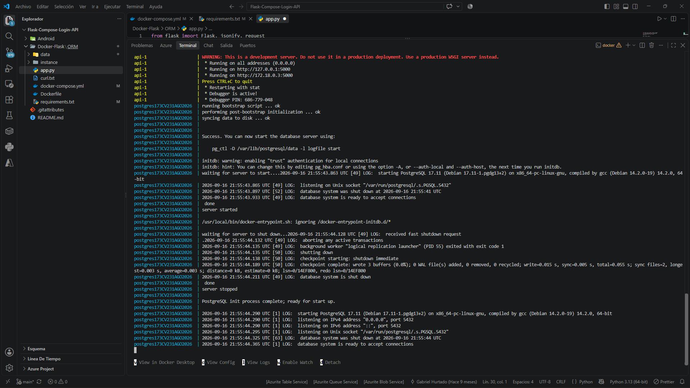 
> **Nota:** Reemplaza 'Cap_1' con la imagen del zip `[cite: 2]` donde se vea la terminal con el mensaje "Engine running" o los logs de Flask.

### Configuración de Red (Móvil vs Emulador)
Para que la aplicación consuma la API local:
* Si se usa el emulador de Android Studio, la URL base debe ser `http://10.0.2.2:5000` `[cite: 1]`.
* Al ejecutar pruebas en un dispositivo físico (como un Samsung Galaxy A56), 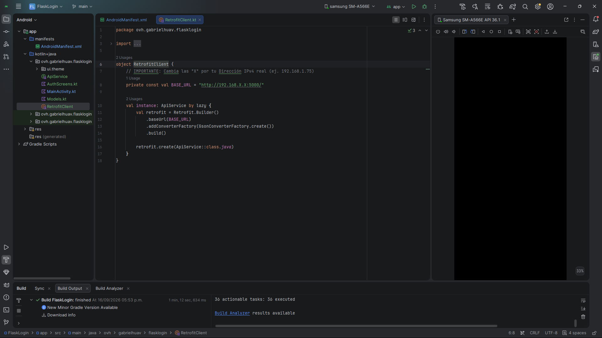 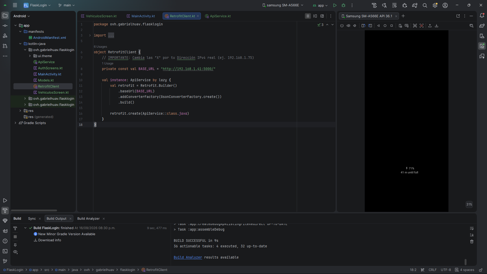se debe sustituir por la dirección IPv4 local del equipo de desarrollo, ya que el celular y la PC deben estar en la misma red Wi-Fi `[cite: 1]`.

---

## 3. Registro de Errores y Soluciones Durante el Desarrollo

Durante la construcción de esta práctica, se registraron y solucionaron dos errores fundamentales relacionados con la arquitectura cliente-servidor:

### Error 1: HTTP 404 NOT FOUND
* **Problema:** Al iniciar sesión exitosamente, la aplicación mostraba una pantalla negra con el error 404.
* **Causa:** El cliente (Android) solicitaba recursos a la ruta `GET /vehiculos`, pero esta ruta no existía en el archivo `app.py` del servidor Flask.
* **Solución:** Se programaron las 4 funciones CRUD (POST, GET, PUT, DELETE) asignándoles la ruta `/vehiculos`. Se reinició el contenedor forzando la reconstrucción con la bandera `--build`.

*(Evidencia: Error 404 en la interfaz gráfica)*
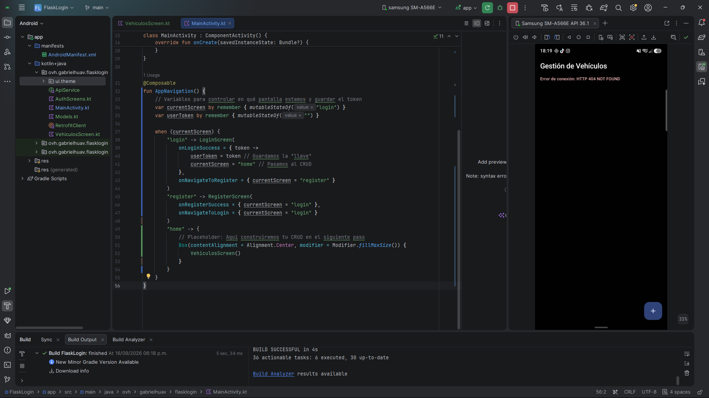

### Error 2: HTTP 401 UNAUTHORIZED
* **Problema:** Tras solucionar el 404, el servidor rechazó la conexión devolviendo un código 401.
* **Causa:** Los endpoints en Flask fueron protegidos exitosamente con la etiqueta `@jwt_required()`. Aunque el usuario iniciaba sesión y obtenía su token, Retrofit (en Android) no estaba adjuntando dicho token en los encabezados de las peticiones subsecuentes.
* **Solución:** Se modificó el archivo `ApiService.kt` para incluir `@Header("Authorization") token: String` en todas las operaciones. Se programó el flujo en `MainActivity.kt` para inyectar el prefijo `Bearer` junto a la llave de sesión en cada llamada.

*(Evidencia: Seguridad funcionando, servidor bloqueando acceso no autorizado)*
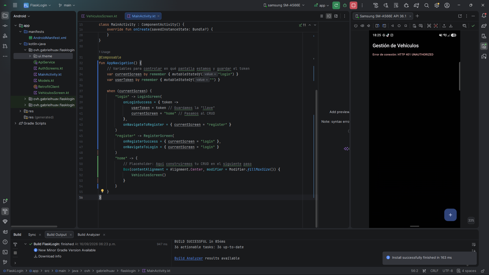

---

## 4. Manual de Operación y Evidencias (CRUD de Vehículos)

A continuación, se demuestra el flujo de la aplicación gestionando los registros (ej. una motoneta Vento Phantom).

### A. Autenticación y Seguridad
El sistema exige la creación de un usuario. Las contraseñas viajan encriptadas mediante Bcrypt. Al iniciar sesión, se expide un token JWT con vigencia limitada `[cite: 1]`.

* Error de credenciales
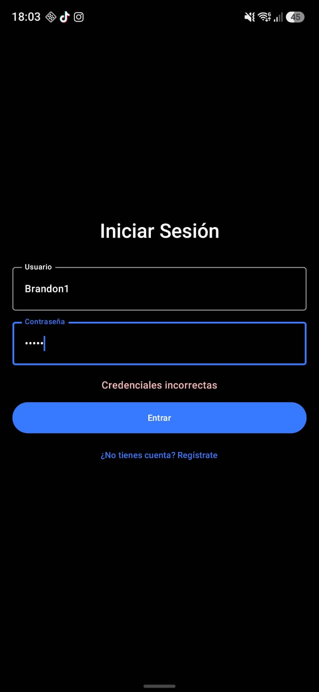

* Registro de Usuario
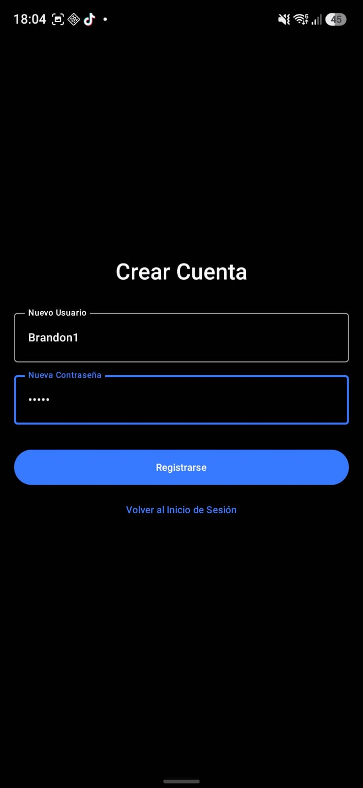

* Inicio de Sesión

### B. Crear Registro (POST)
El usuario autenticado accede a la interfaz y registra un nuevo vehículo presionando el botón flotante.

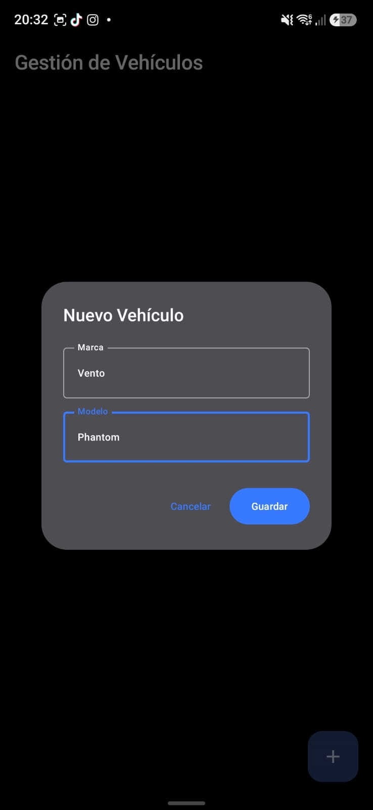

### C. Leer Registros (GET)
El estado de la interfaz (Jetpack Compose) se actualiza de manera asíncrona tras la petición exitosa, mostrando la lista de vehículos obtenidos de PostgreSQL `[cite: 1]`.

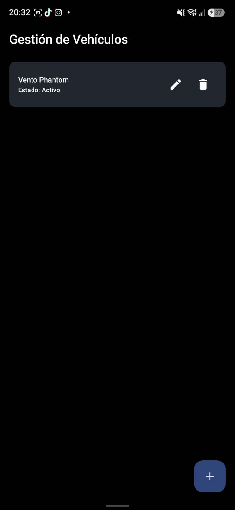

### D. Actualizar Registro (PUT)
Mediante el ícono de edición, el usuario puede modificar los valores (ej. cambiar el estado a "En Mantenimiento").

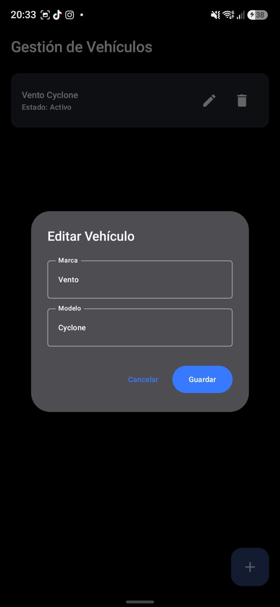
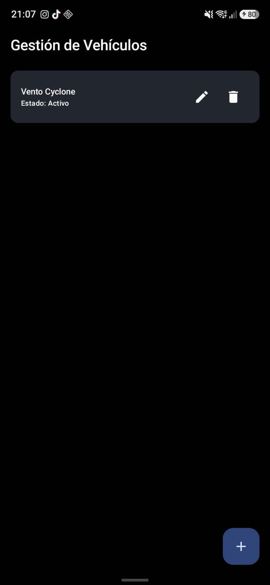

### E. Eliminar Registro (DELETE)
Al presionar el ícono de borrado, la aplicación envía la orden de destrucción permanente del registro `[cite: 1]`.

 ### Nota: Hay algunas capturas tomadas en diferentes horas, fue por error al tomarlas mal y tener que repetirlas o que por descuido no se tomaron.
---

## Conclusión
La transición de una base de datos embebida a PostgreSQL demostró la versatilidad de los contenedores Docker para aislar entornos de desarrollo `[cite: 1]`. Se logró comprender a fondo el ciclo de vida de una petición HTTP: desde la protección de rutas mediante llaves JWT, el manejo de encabezados dinámicos con Retrofit, hasta la actualización de la interfaz gráfica del usuario de forma reactiva en Kotlin.

## Bibliografía
* Instituto Politécnico Nacional, ESCOM. (2026). Práctica 2: Aplicación móvil básica para operaciones CRUD con un servicio REST.